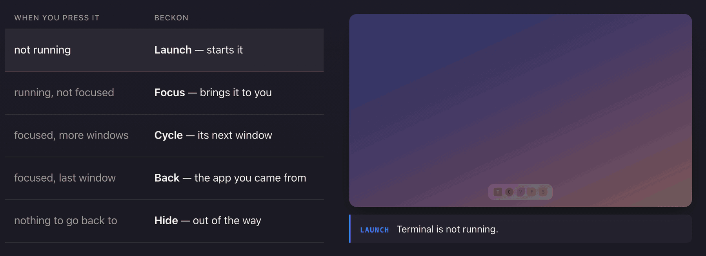

# beckon

> *beckon* (v.) — to call someone toward you with a gesture.
> Press a key, the app comes to you.

**https://xom11.github.io/beckon/** — what it does, in one page.

Cross-platform focus-or-launch app switcher. A thin CLI invoked by your existing
hotkey dotfile (sway, i3, Hammerspoon, AHK) — or, on macOS and Windows,
hosting the hotkeys itself via [resident mode](#resident-mode-macos--windows).



One key, five answers — beckon reads down the list and the first match wins.
The clip is a recording of the [landing page](https://xom11.github.io/beckon/),
where the same demo is interactive.

```
press hotkey
  └── if app not running   → launch it
      if running, unfocused → focus it
      if already focused    → cycle windows / toggle to previous app / hide
```

## Quickstart

```sh
# 1. install (binary lands at ~/.cargo/bin/beckon)
cargo install --git https://github.com/xom11/beckon

# 2. discover the Names beckon sees on your machine
beckon installed | grep -i chrome     # is "Google Chrome" the right Name?
beckon resolve "Google Chrome"        # confirm: shows match type + Exec
beckon doctor                         # diagnose your environment

# 3. wire a hotkey via your existing dotfile — pick yours from
#    examples/ and follow its README:
#       examples/linux/sway/         examples/linux/i3/
#       examples/linux/hyprland/     examples/linux/gnome-x11/
#       examples/linux/kde/          examples/linux/xfce/
#       examples/linux/openbox/      examples/macos/hammerspoon/
#       examples/windows/ahk/
#
#    macOS / Windows alternative — let beckon host the hotkeys itself,
#    no Hammerspoon or AHK needed:
#       examples/macos/serve/        examples/windows/serve/

# 4. press the hotkey. failures fire a desktop notification — you'll see them.
```

Notifications fire only when nothing else would show the error: with stderr on a
terminal, beckon just prints. Beyond that the rule is about who caused the
message, not which command ran — anything you triggered yourself is reported
every time, and anything a timer can repeat on its own is reported at most once
an hour per distinct message. A supervisor relaunching a service with a broken
config (launchd `KeepAlive`, a Task Scheduler repetition) should not mean one
notification a minute; a hotkey you press five times should tell you five times.

- `BECKON_NO_NOTIFY=1` silences them entirely — for scripts and test harnesses,
  which capture stderr and would otherwise look like a hotkey to beckon.
- `BECKON_NOTIFY_LOG=<file>` appends them to a file instead of posting them,
  which is how beckon's own tests assert on this without a notification daemon.

## Status

| Platform | Status |
|----------|--------|
| Linux / sway (Wayland) | ✅ Phase 1a — i3-IPC |
| Linux / i3 (X11) | ✅ Phase 1b — same backend (shared protocol) |
| Linux / X11 generic (GNOME-X11, KDE-X11, XFCE, openbox, awesome) | ✅ Phase 1b.x11 — `x11rb` + EWMH |
| Linux / Hyprland (Wayland) | ✅ Phase 1c — native Unix-socket IPC |
| Linux / GNOME Wayland | ✅ Phase 1d — bundled GNOME Shell extension over D-Bus |
| Linux / KDE Wayland | ✅ Phase 1e — KWin scripting over D-Bus, nothing to install |
| macOS | ✅ Phase 2 — NSWorkspace + AX + CGWindowList |
| Windows | ✅ Phase 3 — Win32 EnumWindows + COM IShellLinkW |

Resident hotkey mode (`serve`) is available on macOS and Windows. Linux
stays compositor-bound by design — the compositor already owns the keybind.

## Install

### Homebrew (macOS / Linux)

```sh
brew install xom11/tap/beckon
```

### Scoop (Windows)

```sh
scoop bucket add xom11 https://github.com/xom11/scoop-bucket
scoop install xom11/beckon
```

### Cargo (build from source)

```sh
cargo build --release
# binary: ./target/release/beckon
```

Requirements: Rust 1.88+ (`rust-version` in `Cargo.toml`, and the floor the
committed `Cargo.lock` can actually build). Linux supports sway, i3, Hyprland, any
EWMH-compliant X11 desktop (GNOME-X11, KDE-X11, XFCE, openbox, awesome),
GNOME Wayland via the bundled shell extension in
[`extensions/`](./extensions/) — install it with `gnome-extensions install`
and log back in — and KDE Wayland via KWin's own scripting engine, which
needs nothing installed. `beckon doctor` reports which backend it picked.
On Windows: VS Build Tools 2022 with the C++ ARM64/x64 component and
Windows SDK.

### cargo install (from GitHub)

```sh
cargo install --git https://github.com/xom11/beckon
# update to latest:
cargo install --git https://github.com/xom11/beckon --force
```

Binary lands in `~/.cargo/bin/beckon` (already in PATH).

### Nix flake

```sh
nix run github:xom11/beckon -- list
nix build .#beckon          # binary at ./result/bin/beckon
nix develop                 # dev shell with rustfmt / clippy / rust-analyzer
```

To pull beckon into your own flake, add the overlay:

```nix
{
  inputs.beckon.url = "github:xom11/beckon";

  outputs = { nixpkgs, beckon, ... }: {
    # ...
    nixpkgs.overlays = [ beckon.overlays.default ];
    # then `pkgs.beckon` resolves
  };
}
```

## Usage

The hot path is `beckon <id>` — invoke from a hotkey binding:

```sh
beckon Spotify           # focus / launch / cycle Spotify
```

Eight names are reserved for subcommands — `list`, `installed`, `search`,
`resolve`, `doctor`, `check`, `serve`, `help`. An app whose id is one of those,
or whose id starts with `-`, goes after a double dash:

```sh
beckon -- search         # the app named "search", not the subcommand
beckon -- -weird.id      # an id that starts with a dash
```

`<id>` resolves against installed-app metadata. Priority per OS:

**Linux** (`.desktop` files in `$XDG_DATA_DIRS/applications/`):

1. `Name=` exact (case-insensitive, normalized) — **recommended for dotfiles**
2. `.desktop` filename
3. `StartupWMClass=`
4. `Name=` substring (alphabetical first wins, like rofi)

**macOS** (`NSWorkspace.runningApplications` + scan of `/Applications`,
`/System/Applications`, `~/Applications` — including one level into
non-.app subdirs to catch `~/Applications/{Brave,Chrome,Vivaldi}
Apps.localized/*.app`):

1. Running app — `localizedName` exact (case-insensitive, normalized)
2. Running app — `bundleIdentifier`
3. Installed app — `CFBundleDisplayName`/`CFBundleName` exact
4. Installed app — `CFBundleIdentifier`
5. Installed app — name substring (alphabetical first wins)

**Windows** (Start Menu `.lnk` shortcuts plus registered shell/MSIX/AppX apps):

1. Display name exact (case-insensitive, normalized)
2. AppUserModelID exact for shell/MSIX/AppX apps
3. Exe filename stem or filename (e.g. `brave` / `brave.exe`)
4. Display name substring (alphabetical first wins)

When the resolved exe is a launcher stub (e.g. Brave PWA `chrome_proxy.exe` →
`brave.exe`), beckon falls back to title matching against running windows.

Names are stable across machines. Chromium PWA hashes are not — bind to the
PWA's own display name, not `brave-fmpnliohj...-Default` or
`com.vivaldi.Vivaldi.app.<hash>`. That hash is minted locally when you install
the PWA, so it differs on your second laptop while the name does not.
On Windows, prefer exact friendly names such as `Terminal`, `Settings`, and
`File Explorer`; shortened `Explorer` can collide with shortcuts that launch
through `explorer.exe`.

### Discovery

```sh
beckon list              # list running apps with their app_ids
beckon installed         # list installed apps (parsed from .desktop)
beckon search files      # fuzzy-search ids matching "files"
beckon resolve Spotify   # show how an id resolves (match type, exec, status)
beckon doctor            # check environment (compositor / IPC / notification daemon)
```

### Dotfile examples — see [`examples/`](./examples/)

Drop-in configs for every supported setup (sway, i3, Hyprland,
GNOME-X11, KDE-X11, XFCE, openbox / awesome / fluxbox, macOS
Hammerspoon, Windows AHK) live under [`examples/`](./examples/) with
short READMEs explaining where to place each file and how to reload.

The examples wire the same five hotkeys everywhere so you only have to
remember the letter, not the modifier:

| Letter | App |
|---|---|
| `T` | Terminal |
| `C` | Chrome |
| `V` | VS Code |
| `F` | Files |
| `S` | Spotify |

Each letter names the app, which is the whole point of binding by letter
rather than by modifier. Five different kinds of program, so the set is
useful on a machine that has none of your other habits.

Modifier defaults are the same three keys on every OS, written left to
right as they sit under your hand: `Ctrl+Super+Alt` on Linux,
`Control+Option+Command` — Hyper — on macOS, `Ctrl+Win+Alt` on Windows.
Replace the Names with whatever `beckon installed` reports on your
machine.

**Three of these are named differently per OS, and that is the point of
`beckon installed`.** The examples use the Name each system actually
reports:

| Letter | macOS | Windows | Linux |
|---|---|---|---|
| `T` | `Terminal` | `Terminal` | `kitty` |
| `C` | `Google Chrome` | `Google Chrome` | `Google Chrome` |
| `V` | `Visual Studio Code` | `Visual Studio Code` | `Visual Studio Code` |
| `F` | `Finder` | `File Explorer` | `Files` (GNOME) / `Dolphin` (KDE) |
| `S` | `Spotify` | `Spotify` | `Spotify` |

A file manager is the clearest case: every desktop ships one and no two
agree on what it is called. `beckon search files` finds yours.

## Resident mode (macOS & Windows)

`beckon serve shortcuts.toml` turns beckon into the hotkey host itself —
no Hammerspoon/AHK layer needed. The file is flat TOML, one combo per line:

    "ctrl+super+alt+t" = "Terminal"
    "ctrl+super+alt+shift+t" = "Telegram Web"

Ready-to-use setups, including the launchd agent and the Scheduled Task
definition: [`examples/macos/serve/`](examples/macos/serve/) and
[`examples/windows/serve/`](examples/windows/serve/).

On macOS installed via Homebrew, `brew services start beckon` is the whole
install — the formula ships the LaunchAgent. Create and `beckon check`
`~/.config/beckon/apps.toml` first.

On Windows, `scoop install xom11/beckon` puts **beckon serve** in your Start
Menu — that launches `beckon-serve.exe`, a tray app with no console window at
any point (it's a separate GUI-subsystem binary, not `beckon.exe serve`
wearing a different hat). First launch with no config writes a starter
`apps.toml` and opens it in your editor. Right-click the tray icon to reload,
pause, open the log, or open **Settings**; tick **Start with Windows** to add
it to `HKCU\...\Run`. `beckon.exe serve <CONFIG>` still works for scripting
or the advanced path below — same flags, same output — and now raises the
same tray menu too, minus **Start with Windows**: a Run value pointing at
`beckon.exe` has no `serve` verb or config path to invoke, so it would exit
at the next logon while the checkbox stayed ticked forever.

### The settings window (Windows)

**Settings...** in the tray menu — or double-clicking the icon — opens a
window listing every binding with whether it actually registered and whether
its app name resolves. **Save** writes the same `apps.toml` you would edit by
hand: comments, key order and spelling survive, so the two routes stay
interchangeable. Edit the file in Notepad while the window is open and it
follows along; if you had unsaved changes it asks rather than choosing for
you.

The window is bands stacked top to bottom, not panes side by side:

- a banner, only when the file changed on disk under you — **Reload** or
  **Keep mine**;
- a head row: a **Filter** box on the left, **Remove** and **Add** on the
  right;
- the list itself, as tall as the window leaves room for — drag the window
  taller and you see more bindings, shorter and it scrolls. **App** leads and
  **Shortcut** follows, because the app is what you are looking for. Every row
  carries a checkbox: tick as many as you like and **Remove** takes them all
  at once;
- an editor strip — **App** as a combo box you can type into or pick from, and
  the shortcut as four modifier buttons (**Ctrl**, **Win**, **Alt**, **Shift**)
  beside a closed list of key names, so a chord that cannot exist cannot be
  entered. **Record** and **Revert** close the strip: **Record** captures a
  chord you press, **Revert** clears the row's shortcut. A notes line under the
  strip explains the selected row;
- a command bar: **Open config file** on the left, then **Close** and
  **Save**. **Save** is where the default button ring rests, so Enter saves
  from any of the text fields, the list or the check boxes. Tab onto a push
  button and the ring follows your focus — Enter then presses *that* button,
  which is deliberate: Enter on a focused **Reload** used to save instead,
  overwriting the very external change the banner exists to warn you about.
  **`Ctrl+S` saves too**, wherever focus is, on the two pages that write
  `apps.toml`. The other two write nothing to it, and there the keystroke
  does nothing rather than saving behind your back. The page is the only
  gate: being on a writing page is what the accelerator checks, not whether
  **Save** looks pressable.

Rows say nothing when they are fine. When they are not, the App cell carries
one word:

| Flag | Means |
|---|---|
| `in use` | Windows refused the chord — something else already owns it |
| `missing` | no app of that Name on this machine |
| `paused` | beckon is paused, so nothing is active |
| `other chord` | the chord does not match your Caps Lock hold, so Caps cannot reach it |

A row can be more than one of these; the flag shows the first that applies, in
the order above.

**The word is usually the whole message.** The notes line under the editor
adds a sentence only where there is something the word cannot say — `in use`
gets *"Another program owns this key. Windows will not say which."*, because
Windows does not tell beckon which program and no amount of looking will find
out. The others say nothing further, and a healthy row says nothing at all.
The flag and the notes come out of one function, so the cell and the line
cannot tell you different things.

The App combo box types freely — it does not autocomplete or jump to a
catalogue entry as you type. Apps with no Start Menu entry are typed in by
hand, which is why.

**Record** captures a chord by pressing it, and **Stop** — the same button,
while it is armed — ends the recording. It works on the chords beckon
recommends: it arms a low-level keyboard hook rather than a capture field, so
it sees the Windows key, and `Win+T` and its siblings reach beckon instead of
Explorer because the hook runs before the shell does and swallows the key.
`Win+L` and `Ctrl+Alt+Del` are refused rather than recorded, and so are Caps
Lock, Num Lock and Scroll Lock as the main key. The hook is armed only while
the button reads **Stop**; leaving the page, closing the window or quitting
disarms it.

The buttons and the key list stay the primary path. They are the only way in
for anyone who cannot physically produce a chord, and they hold the keys a
recording can never see — a bare `escape`, a bare `tab`.

**If `apps.toml` does not parse, `beckon-serve.exe` starts anyway.** You get
the tray icon, no hotkeys registered, and nothing written to the file — and
**Settings...** opens read-only with the parse error on screen and **Open
config file** one click away. Fix the file, and the next reload picks it up.
Refusing to start was worse: it left a first-time user with a modal error, no
tray, and the one window built to explain the problem unreachable.

`beckon.exe serve` still refuses a file it cannot parse and exits non-zero —
it has a console to print to and callers that check the code — and
`beckon check` is unchanged. If you drive `beckon.exe serve` from the
Scheduled Task in [`examples/windows/serve/`](examples/windows/serve/), note
that its `<RestartOnFailure>` and an exit-1 on a broken config make a
restart loop that never gets anywhere; the tray binary is the better host.

### Caps Lock as the beckon key (Windows, opt-in)

`ctrl+super+alt+<key>` is a lot of fingers. Tick the Caps Lock check box in
Settings — or write `keyboard.caps = true` in the config, which is the same
setting — and holding Caps stands in for that chord: `Caps+T` does what
`ctrl+super+alt+T` does. Your bindings do not change, so the same file still
works on a machine where the box is not ticked.

Tapping Caps on its own still toggles Caps Lock by default.
`keyboard.caps_tap = "escape"` makes it Esc instead, and `"none"` makes it
do nothing.

By default the chord Caps stands in for is `ctrl+super+alt`.
`keyboard.caps_hold = "ctrl+alt"` changes which one — only `ctrl`, `super`
and `alt` are accepted; `shift` is refused, because releasing Shift while
you are physically holding it makes everything you type next lowercase
until you let go and press it again. Settings shows the same three keys as
Hold check boxes next to the Caps Lock box; ticking or clearing one there
writes `keyboard.caps_hold` for you.

One thing worth knowing if you edit the file by hand rather than through
Settings: `keyboard.caps_hold` is written to `apps.toml` only when it
differs from the default. That is deliberate, not an omission — this key
did not exist in earlier beckon releases, and an unknown key under
`keyboard` is a hard parse error, so a file that always carried it would be
rejected outright by any beckon built before it. Writing it only when it
carries information keeps the default-chord case readable by every past
version, which matters on a machine that updates through Scoop while
another one has not yet.

Three things to know before ticking it:

- **It does nothing while an elevated window has focus.** beckon runs at
  normal integrity and Windows does not deliver those keys to it. Typing
  `ctrl+super+alt+T` by hand still works there — that path does not go
  through the hook — so this is a gap, not a dead end. Both halves verified
  against an elevated Task Manager.
- **It conflicts with other remappers.** If kanata, PowerToys Keyboard
  Manager or an AutoHotkey script already claims Caps Lock, beckon never
  sees the key. Use one of them, not both.
- **It installs a low-level keyboard hook,** which is the same mechanism
  every remapper uses and the same one antivirus software associates with
  keyloggers. Turning this on is one of two things that installs it; the
  other is **Record** in Settings, for the seconds a recording lasts.

Modifiers: `ctrl`, `super` (Cmd / Win key), `alt` (Option), `shift` — order
is free. Keys are lowercase only (`a`-`z`, `0`-`9`, `f1`-`f20`, plus named
specials like `space` / `comma` / `pageup`); a shifted binding is written as
the base key plus an explicit `shift`. `f20` is the ceiling because macOS
has no keycode above it, and every key must exist on both OSes so a config
validates anywhere.

`beckon check shortcuts.toml` validates a file (exit 0/1) without touching
the OS — it runs on Linux too, so it works in CI. The file is watched: edits
apply live, and a broken edit keeps the current bindings and fires a
notification instead of dropping your keys. One `serve` per config path is
enforced with a lock file.

`beckon check --resolve shortcuts.toml` additionally grades each app name
against what *this machine* has installed. There are three tiers — an exact
match, a substring guess, or no match at all — and **only a no-match fails
the check.** A no-match exits 1 and lists the dead bindings, the case where a
file is perfectly valid and the keys still do nothing, because the apps were
never installed here. A guess still resolves, so it prints in its own block
instead, saying why: one candidate means a later install can quietly take
the name; several means the winner is already decided by sort order, not by
anything you wrote. It does not fail the check — two of this project's own
bindings live on that tier on purpose (`Settings` matching *System
Settings*). Naming the app exactly is what turns a guess into an exact
match. It reads installed-app metadata (`.desktop` files / LaunchServices /
the Start menu), and on macOS the running apps too, since that is where
`resolve` starts there. It never asks the compositor, so it runs over SSH
and in a headless VM. Keep it off in CI: a runner has none of your apps, so
every name comes back a no-match.

**Trust the registration count, not the shortcut count.** Startup and reload
report `5 shortcuts registered` when clean and `3 of 5 shortcuts registered
(2 failed)` when another app already owns a chord — a config can parse
perfectly and still register nothing. On Windows the tray tooltip carries the
same phrase (plus `paused (...)` while hotkeys are paused), so hovering the
icon answers it without opening the log.

`serve` is a foreground process, not a service — `RegisterHotKey` needs an
interactive desktop, which is why there's a tray icon at all. For a
supervised setup that restarts on crash, see
[`examples/windows/serve/`](examples/windows/serve/), which runs
`beckon.exe serve` under a Scheduled Task with `RestartOnFailure` instead of
the tray app. Linux stays compositor-bound by design.

## What `beckon <id>` actually does

Single algorithm, not configurable:

```
1. resolve id → app metadata (.desktop / Info.plist / .lnk)
2. if no window of this app  → launch
3. if running but unfocused  → focus first window
4. if focused, more windows  → cycle to next window of same app
5. if focused, sole window   → toggle to the previously focused app
6. if nothing else exists    → hide / minimize
```

When a hotkey-bound invocation fails (id not found, IPC error), beckon fires
a desktop notification (`notify-send` on Linux, toast on Windows). Run from a
terminal to see errors on stderr instead.

## Project layout

```
crates/
├── beckon-core/      # Backend trait, shared types
├── beckon-linux/     # algorithm.rs (shared) + i3-IPC + Hyprland + EWMH
├── beckon-macos/     # NSWorkspace + AX (cycle) + CGWindowList (z-order)
├── beckon-windows/   # Win32 EnumWindows + .lnk and MSIX/AppX catalog
└── beckon-cli/       # binary, clap CLI, doctor / search / resolve
examples/             # ready-to-use configs for every supported OS / WM
```

See [`CLAUDE.md`](./CLAUDE.md) for the full design rationale.

## Testing on i3 without leaving sway

```sh
./test-i3-env.sh start    # Xwayland :3 → Xephyr :2 → i3
./test-i3-env.sh xterm    # spawn xterm in :2 to play with
./test-i3-env.sh stop     # tear down
```

Then inside the i3 sandbox:

```sh
env -u SWAYSOCK -u WAYLAND_DISPLAY \
    I3SOCK=$(ls /run/user/1000/i3/ipc-socket.* | head -1) DISPLAY=:2 \
    ./target/release/beckon list
```

## Out of scope

No alias mapping and no resolve cache — ids resolve against OS metadata
(`.desktop` / LaunchServices / Start Menu) on every call. No interactive
launcher (use rofi for that). No window tiling or layout management.

The one config file beckon reads is the `serve` shortcuts TOML, and it maps
hotkeys to Names — it is not a place to alias or configure `beckon <id>`
itself, which stays config-free. Hotkey registration is still the dotfile's
job everywhere except macOS/Windows resident mode.

## License

Licensed under either of

* Apache License, Version 2.0 ([LICENSE-APACHE](LICENSE-APACHE))
* MIT License ([LICENSE-MIT](LICENSE-MIT))

at your option.

### Contribution

Unless you explicitly state otherwise, any contribution intentionally submitted
for inclusion in this crate by you, as defined in the Apache-2.0 license, shall
be dual licensed as above, without any additional terms or conditions.
