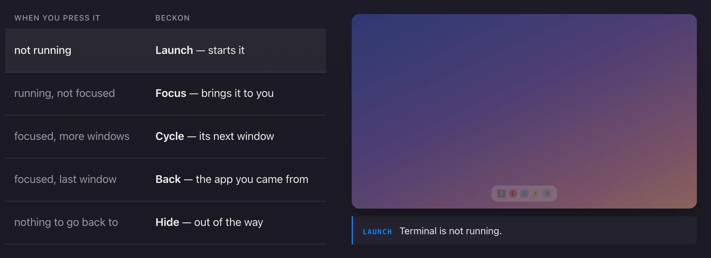

# beckon

> *beckon* (v.) — to call someone toward you with a gesture.
> Press a key, the app comes to you.

One key per app. Press it and the app launches if it is closed, comes forward if
it is open, and cycles its windows if you are already there — so you stop
alt-tabbing to find things. The same key, and the same config, on macOS, Windows
and Linux.

**[See it in one page →](https://xom11.github.io/beckon/)**



## One key, five answers

beckon reads down this list and the first match wins. There is nothing to
configure — this is the whole behaviour.

| When you press it | beckon |
|---|---|
| not running | **Launch** — starts it |
| running, not focused | **Focus** — brings it to you |
| focused, more windows | **Cycle** — its next window |
| focused, last window | **Back** — the app you came from |
| nothing to go back to | **Hide** — out of the way |

## Install

**macOS**

```sh
brew install xom11/tap/beckon
```

**Windows**

```sh
scoop bucket add xom11 https://github.com/xom11/scoop-bucket
scoop install xom11/beckon
```

<details>
<summary><b>Other ways</b> — Cargo, Nix, build from source</summary>

```sh
# Cargo — lands in ~/.cargo/bin/beckon
cargo install --git https://github.com/xom11/beckon

# Nix
nix run github:xom11/beckon -- list

# From a clone
cargo build --release      # binary at ./target/release/beckon
```

Building needs Rust 1.88+. On Windows, VS Build Tools 2022 with the C++
component and the Windows SDK.

To pull beckon into your own flake:

```nix
{
  inputs.beckon.url = "github:xom11/beckon";

  outputs = { nixpkgs, beckon, ... }: {
    nixpkgs.overlays = [ beckon.overlays.default ];
    # then `pkgs.beckon` resolves
  };
}
```

</details>

## Set up your keys

On **macOS and Windows**, beckon can hold the hotkeys itself. You write a small
file of key → app, and that is the whole setup.

```toml
# ~/.config/beckon/apps.toml
"ctrl+super+alt+t" = "Terminal"
"ctrl+super+alt+c" = "Google Chrome"
"ctrl+super+alt+s" = "Spotify"
```

### macOS

```sh
beckon check ~/.config/beckon/apps.toml   # is the file valid?
brew services start beckon                # start it, and start it at login
```

A small mark appears in the menu bar. Click it to reload, pause, or open
Settings.

macOS will ask for **Accessibility** permission the first time — beckon cannot
move another app's windows without it.

### Windows

Open **beckon serve** from the Start Menu. The first run writes a starter
`apps.toml` and opens it in your editor.

You get a tray icon: right-click to reload, pause, open the log, or open
**Settings**. Tick **Start with Windows** and it comes back at every logon.

### Linux

Your window manager or desktop already binds keys, so beckon is just the
command it runs:

```
# sway / i3
bindsym $mod+c exec beckon "Google Chrome"

# Hyprland
bind = SUPER, C, exec, beckon "Google Chrome"
```

GNOME, KDE, XFCE and friends: add a custom shortcut in Settings pointing at
`beckon "Google Chrome"`.

Works on sway, i3, Hyprland, GNOME, KDE, XFCE, openbox and any EWMH desktop.
GNOME on Wayland needs the small extension in [`extensions/`](./extensions/);
KDE needs nothing. Ready-made configs for each are in
[`examples/`](./examples/).

## Pick your letters

The examples bind the same five letters everywhere, so you only have to
remember the letter and not the modifier:

| Letter | App |
|---|---|
| `T` | Terminal |
| `C` | Chrome |
| `V` | VS Code |
| `F` | Files |
| `S` | Spotify |

The modifier is the same three keys on every OS — `Ctrl+Super+Alt` on Linux,
`Control+Option+Command` on macOS, `Ctrl+Win+Alt` on Windows.

**Use the name your machine actually uses.** A file manager is the clearest
case: every system ships one and no two call it the same thing.

| Letter | macOS | Windows | Linux |
|---|---|---|---|
| `F` | `Finder` | `File Explorer` | `Files` / `Dolphin` |

Run `beckon installed` to see the names on your machine, or
`beckon search files` to hunt for one.

## Commands

```sh
beckon Spotify           # the hot path — focus, launch, or cycle
beckon installed         # every app beckon can see, with its name
beckon search files      # find a name you are not sure of
beckon resolve Spotify   # what would this name actually open?
beckon doctor            # is my environment set up correctly?
beckon check apps.toml   # is my shortcuts file valid?
```

`beckon check --resolve apps.toml` goes further and checks each name against
what is really installed here — handy after copying a config to a new machine.

## Settings window (macOS & Windows)

Open it from the menu bar or tray icon.

It lists every shortcut with whether it actually registered and whether the app
name resolves, and lets you add, edit or remove bindings. **Record** captures a
chord by pressing it. Saving writes the same `apps.toml` you would edit by
hand — comments and ordering survive, so both routes stay interchangeable.

A row stays quiet when it is fine. When it is not, it says one word:

| | |
|---|---|
| `in use` | something else already owns that key |
| `missing` | no app of that name on this machine |
| `paused` | beckon is paused |
| `other chord` | that chord does not match your Caps Lock hold |

## Caps Lock as the beckon key (Windows, optional)

`Ctrl+Super+Alt+T` is a lot of fingers. Tick the Caps Lock box in Settings and
holding Caps stands in for that chord — `Caps+T` does what `Ctrl+Super+Alt+T`
does. Your file does not change, so it still works on a machine without the
box ticked.

Tapping Caps on its own still toggles Caps Lock, or you can make it Escape.

Two things worth knowing: it does nothing while an elevated window has focus
(type the full chord there instead), and it will not work alongside another
remapper that already claims Caps Lock, such as kanata or PowerToys.

## Good to know

**Use names, not ids.** `Claude`, `Spotify`, `Google Chrome` — these are stable
across machines. The ids browsers mint for installed web apps contain a hash
generated on that machine, so they differ on your second laptop.

**When a hotkey fails, beckon tells you.** Run from a hotkey and you get a
desktop notification; run from a terminal and you get a plain error. Set
`BECKON_NO_NOTIFY=1` to silence notifications entirely.

**Trust the registration count.** Startup reports `5 shortcuts registered`, or
`3 of 5 shortcuts registered (2 failed)` when another app already owns a key —
a file can be perfectly valid and still register nothing.

**Eight words are reserved** for beckon's own commands: `list`, `installed`,
`search`, `resolve`, `doctor`, `check`, `serve`, `help`. If you really have an
app called one of them, put it after a double dash — `beckon -- search`.

## Contributing

Bug reports and pull requests are welcome. `CLAUDE.md` carries the full design
rationale and the measurements behind most decisions, if you want the long
version.

## License

Licensed under either of

* Apache License, Version 2.0 ([LICENSE-APACHE](LICENSE-APACHE))
* MIT License ([LICENSE-MIT](LICENSE-MIT))

at your option.

Unless you explicitly state otherwise, any contribution intentionally submitted
for inclusion in this crate by you, as defined in the Apache-2.0 license, shall
be dual licensed as above, without any additional terms or conditions.
